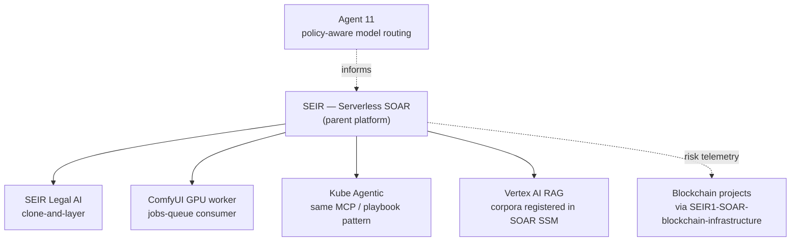

# Cloud Architecture Portfolio — John Sweeney

Cloud security, AI platform, and multi-cloud infrastructure engineering on AWS, GCP, and Kubernetes — plus DeFi smart-contract work.

Each project here is a short engineering story: the problem, the design, the architecture, and what it demonstrates. Code, installation, testing, and deployment detail live in each project's own repository, linked from its page.

```
Portfolio (this page)
    ↓
Domain page        — groups related work
    ↓
Project page       — problem · solution · architecture · impact · highlights
    ↓
Code repository    — code · install · testing · deployment · implementation detail
```

> 🔒 marks a private repository. Available for demos. Email [jastek.sweeney@gmail.com](mailto:jastek.sweeney@gmail.com).

---

## Featured work

| Project | What it demonstrates | Domain |
|---|---|---|
| [**SEIR — Serverless SOAR**](architectures/serverless/README.md) | Three-layer RBAC, autonomous WAF correlation → incident response, threat-intel enrichment, and an agentic Bedrock tier behind an MCP control plane. 436 unit tests. | Security / AI Platform |
| [**SEIR Legal AI**](architectures/legal-platform/README.md) | A production legal-drafting fleet built on the SOAR foundation. Redaction happens before any model sees a document, and IAM enforces it, not prompts. | Security / AI Platform |
| [**Kube Agentic**](architectures/kube-agentic/README.md) | Zero-trust MCP for AI agents on Kubernetes: an mTLS gateway, deterministic playbooks, and gated tool execution. | Kubernetes |
| [**Zion — Multi-Region Transit Gateway**](architectures/transit-gateway/README.md) | Seven-region AWS footprint, Transit Gateway mesh, geo DNS, Japan-only data residency, self-hosted PLG observability. | Cloud Networking |
| [**Japan Medical — APPI Cross-Cloud**](architectures/healthcare-cross-platform/README.md) | PHI kept in Tokyo while AWS São Paulo and GCP compute read and write over TGW and HA VPN (BGP), with Bedrock-assisted incident response. | Cloud Networking |
| [**Uniswap v4 Arbitrage Bot**](architectures/blockchain/trading-bot-v4.md) | Self-funding arbitrage using v4 flash accounting. The bot simulates each trade before executing, and a pair scanner filters out liquidity mirages. | Blockchain |
| [**Leveraged Yield Farm (Aave V3)**](architectures/blockchain/yield-farm-aave-v3.md) | Migration from Compound V2 to Aave V3 with Balancer flash loans and a measured health-factor safety model. | Blockchain |

---

## Domains

| Domain | Scope | Projects |
|---|---|---|
| [**Security / AI Platform**](domains/security-ai-platform.md) | SOAR, RBAC, agentic AI governance, MCP control planes, model routing, RAG, GPU inference | 5 |
| [**Cloud Networking**](domains/cloud-networking.md) | Transit Gateway, HA VPN + BGP, hub-and-spoke, data residency, multi-cloud | 4 |
| [**Kubernetes**](domains/kubernetes.md) | EKS, mTLS gateways, Kong, Helm, observability, agent workloads | 2 |
| [**Blockchain**](domains/blockchain.md) | Flash loans, DeFi lending, DEX arbitrage, smart-contract security | 2 featured + archive |

---

## How the work connects

Most of this portfolio grows out of one platform. **SEIR — Serverless SOAR** is the parent: its Cognito/WAF-gated jobs API, MCP control plane, and reusable CI workflows are shared by its descendants.



A few design rules repeat across every project:

- **The model explains; code authorizes.** Severity, playbook selection, and tool permission are deterministic. LLMs write the narrative.
- **Fail closed, and say so.** A fallback has to be observable. The SOAR page tells the incident that proved it.
- **Data residency is a routing decision.** Where data lives is enforced by network paths and IAM, not by convention.

---

## About

DevOps and cloud infrastructure engineer. Terraform, AWS, GCP, Kubernetes, Python, and CI/CD. Earlier career: 14 years in game production and release management (Activision-Blizzard, 2K, 505 Games).

[Résumé](https://github.com/jastek69/resume) · [GitHub](https://github.com/jastek69) · [LinkedIn](https://www.linkedin.com/in/john-sweeney-9b97262/)
