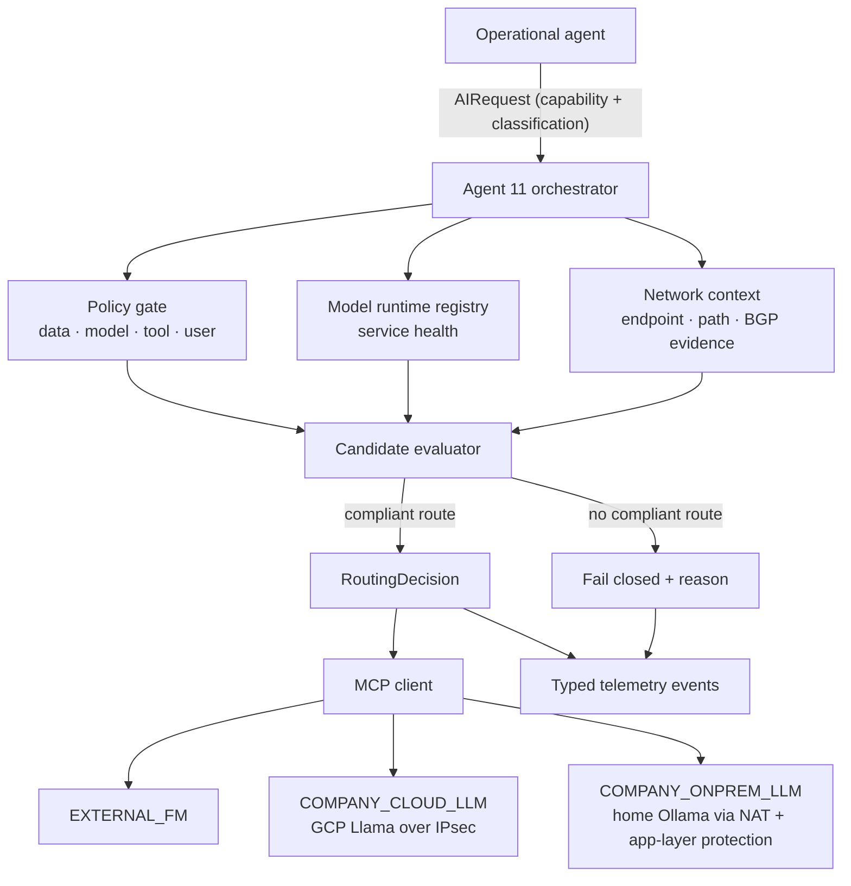

# Agent 11 — Policy-Aware Model Routing

[← Portfolio](../../README.md) · [Security / AI Platform](../../domains/security-ai-platform.md)

**Supporting** · AWS EC2 + GCP + on-prem · Python · 2026
**Repository:** [jastek69/armageddon-12E-Agent11](https://github.com/jastek69/armageddon-12E-Agent11) 🔒

> An orchestration layer between operational agents and the AI services they use. **An agent requests a capability; it never chooses the model.** Agent 11 decides which approved reasoning destination (an external foundation model, a company cloud LLM, or an on-prem Llama) may safely and effectively serve the request, and fails closed when none can.

---

## Problem

Companies increasingly run several models at once: a SaaS foundation model, a model in their own cloud account, and one on hardware they own. Agents written against one of them hard-code logic like `if sensitive: use_model_x()`, which couples business code to infrastructure. That coupling also blurs four questions that must stay separate:

| Question | Example of confusing it |
|---|---|
| **Policy.** May this data go to this destination? | "It's reachable, so send it." |
| **Service.** Can this model do the work? | "It's authorized, so it must be capable." |
| **Network.** Is there a viable path right now? | "The model is healthy, so the path must be up." |
| **Routing.** Which permitted, capable, reachable route should be used? | "A path exists, so use it." |

## Solution

- **Logical destinations.** `EXTERNAL_FM`, `COMPANY_CLOUD_LLM`, and `COMPANY_ONPREM_LLM` stand in for vendors, so any destination can be swapped without touching agents.
- **Classify before transmit.** Every `AIRequest` carries a data classification (organization-defined, e.g. `NORMAL` / `E7`–`E9`) that's evaluated *before* any routing. Data is never sent first and checked afterward.
- **Independent evaluators.** Data, model, tool, and user policy gates; a model-runtime health registry; network path assessment (VPN, private link, Internet, BGP evidence); then a candidate evaluator and a policy-safe fallback.
- **Auditable decisions.** Each routing decision records why a route was chosen or blocked, as typed telemetry events (policy, routing, governance, execution, verification).

## Architecture

## Impact

- **Worked through as a ten-phase build:** architecture contract → typed models and enums → data policy → runtime registry → network context → routing → MCP → orchestrator → telemetry → failure testing.
- **Live connectivity labs** run the MCP server on AWS EC2, reach a GCP-hosted Llama over private cloud-to-cloud IPsec, and reach a home-network Ollama as a genuine on-prem integration (RFC 1918 + NAT + public exposure + application-layer protection).
- **About 430 inline contract tests**, 310 passing. Most of the rest specify registry discovery features written test-first, ahead of the code.
- The typed-domain-model approach (`BaseModel`, enums, round-trip tests) was carried into the [SEIR SOAR](../serverless/README.md) `models/` package.

## Engineering highlights

- **`UNKNOWN` ≠ `UNAVAILABLE`.** Stale observations and conflicting evidence are modeled explicitly, so a missing health check isn't read as a failed service.
- **Network failure vs service failure** are distinguished, so fallback behaves correctly: a down path shouldn't blacklist a healthy model.
- **Organization-neutral taxonomy.** Classifications live in policy, not code, so another company can swap in `PUBLIC` → `HIGHLY_RESTRICTED` without a redesign.

## Technologies

Python (typed domain models, protocols, dependency injection) · MCP · AWS EC2 · GCP · Ollama / Llama · IPsec VPN · pytest

## Repository links

- Architecture contract, code, and connectivity labs: [armageddon-12E-Agent11](https://github.com/jastek69/armageddon-12E-Agent11) 🔒
