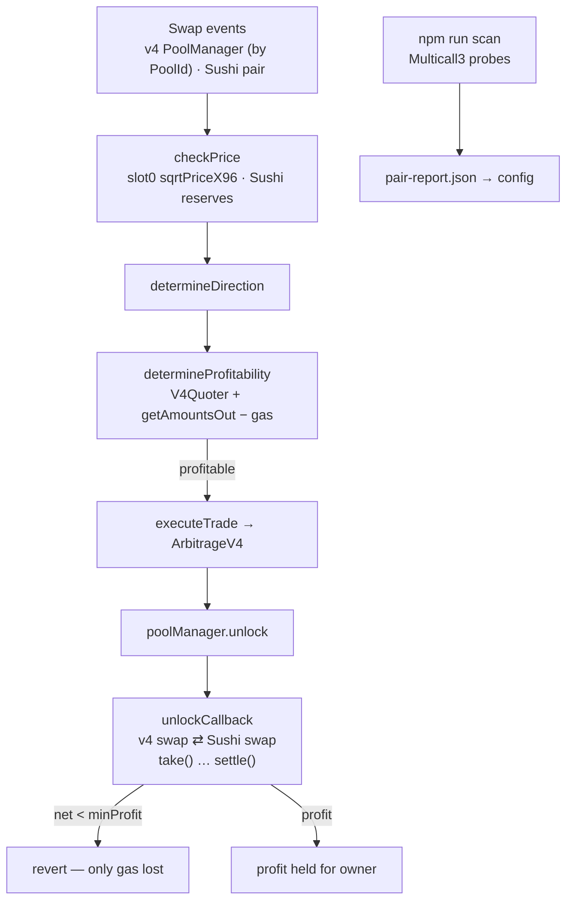

# Uniswap v4 Arbitrage Bot

[← Portfolio](../../README.md) · [Blockchain](../../domains/blockchain.md)

**Featured** · Ethereum mainnet (fork-tested) · Solidity + Node · 2026
**Repository:** [jastek69/trading_bot-master](https://github.com/jastek69/trading_bot-master)

> An arbitrage bot that trades a Uniswap v4 pool against a Sushiswap V2 pair. It uses v4 **flash accounting** instead of a flash loan, so it needs no capital, pays no loan fee, and reverts entirely unless the round trip is profitable.

---

## Problem

- **Capital.** Cross-DEX arbitrage needs inventory, or a flash loan with a fee and a dependency on someone else's liquidity.
- **Uniswap v4 broke every existing integration.** The singleton `PoolManager` has no pair addresses, no `getReserves()`, and no per-pool events. V2/V3 bots need rebuilding, not porting.
- **Most apparent opportunities aren't real.** A large, persistent spread usually means one side has no liquidity.

## Solution

- **Self-funding execution.** `ArbitrageV4.sol` performs both legs inside `unlockCallback`, `take()`s tokens before paying, and `settle()`s only the net.
- **v4-native market data.** Prices come from `StateView.getSlot0()` (`sqrtPriceX96`), swaps are detected from PoolManager events filtered by PoolId, and trades are simulated with the official `V4Quoter`. Native-ETH pools are supported.
- **Verify before trading.** `npm run scan` enumerates Sushiswap WETH pairs, derives candidate v4 PoolIds across all fee tiers, simulates real round trips, and samples 14 days of spreads. Pairs whose round trip loses 90% or more are flagged `thin v4 side` instead of ranked.

## Architecture

## Impact

- **Stable, fast fork tests.** 6 mainnet-fork tests, all green. Pinning the fork block took the suite from about 60 s with intermittent failures to about 6 s. CI compiles on every push and runs the fork suite when an RPC secret is set.
- **Scanner output drops straight into config**, ranked by whether a pair is genuinely tradable before how often it beats fees.
- **Optional risk telemetry** feeds a SOAR pipeline ([SEIR1-SOAR-blockchain-infrastructure](https://github.com/jastek69/SEIR1-SOAR-blockchain-infrastructure) 🔒) that turns events into triaged incidents and a daily report.

## Engineering highlights

- **A liquidity mirage.** The first scan ranked WETH/IMX and WETH/AAVE first, with spreads above the fee hurdle on 14 of 14 days. Their probe round trips lost over 98%: the v4 side held dust. The spread persisted *because* nobody could trade it.
- **Hard-coded decimals are a silent bug.** Inherited helpers assumed 18 decimals everywhere, which is wrong for USDC (6) by twelve orders of magnitude.
- **Failure directions are chosen.** Telemetry fails open (monitoring can't stop trading), while the halt flag fails safe (an SSM error keeps the last known value).

## Technologies

Solidity 0.8.26 (Cancun, transient storage) · Uniswap v4 (`PoolManager`, `StateView`, `V4Quoter`) · Sushiswap V2 · Hardhat 2.29 · ethers v6 · Multicall3 · Alchemy · AWS SDK v3 (optional telemetry)

## Repository links

- Code, fork tests, and scanner: [trading_bot-master](https://github.com/jastek69/trading_bot-master)
- Sibling: [Leveraged Yield Farm — Aave V3](yield-farm-aave-v3.md)
