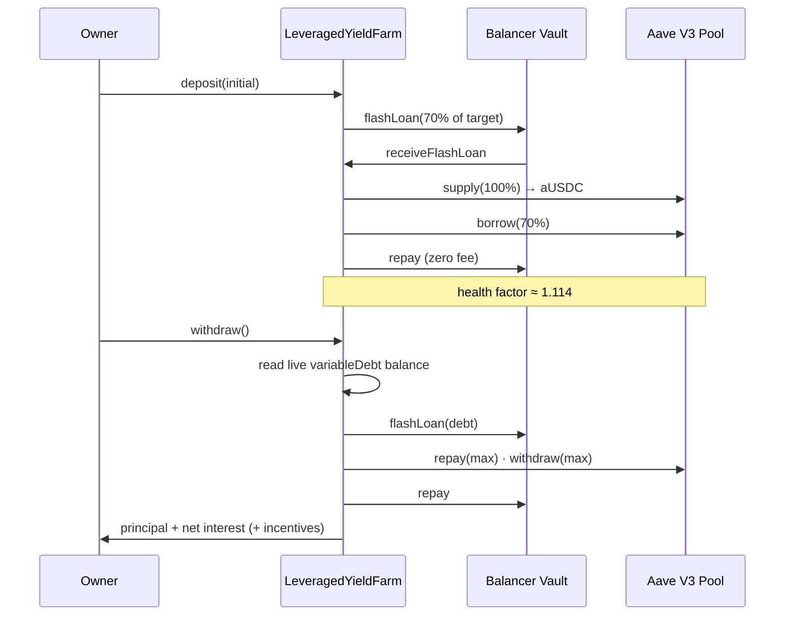

# Leveraged Yield Farm — Aave V3

[← Portfolio](../../README.md) · [Blockchain](../../domains/blockchain.md)

**Featured** · Ethereum mainnet (fork-tested) · Solidity + Node · 2026
**Repository:** [jastek69/YieldFarm](https://github.com/jastek69/YieldFarm) 🔒

> A leveraged USDC position on Aave V3, opened and closed in one transaction each by using a zero-fee Balancer flash loan. It's a migration from a Compound V2 strategy that stopped being viable, redone with the risk arithmetic made explicit.

---

## Problem

- **The original protocol was deprecated.** The Compound V2 loop was profitable only because COMP rewards covered the borrow–supply spread. Those rewards have wound down.
- **The obvious migration target rejected the obvious asset.** Aave governance set DAI's loan-to-value to **zero**, so a DAI loop can't even be opened on Aave V3.
- **Leverage has a hard arithmetic limit.** A same-asset loop earns only while `supplyRate × supplied > borrowRate × debt`.

## Solution

- **Aave V3 with USDC.** USDC's 75% LTV and 78% liquidation threshold accommodate the strategy's 70% borrow ratio. The asset is a constructor parameter.
- **Flash-loan bootstrapped entry.** Borrow 70% from Balancer, supply 100% to Aave, then borrow back to repay. The result is `supplied = 10/3 × initial` against `debt = 7/3 × initial`.
- **Exit reads live debt.** `withdraw()` flash-loans the *current* variable-debt balance, not a recomputed value, so accrued interest can never leave residue.

## Architecture

## Impact

- **A full-cycle mainnet-fork test** (4 tests, all green). Swap ETH → USDC, open the position, advance 1,000 blocks, unwind, and assert the owner gets more USDC back with zero debt remaining. In the last run, 120 USDC in returned 120.10.
- **An honest investment verdict.** At current rates the levered position earns about +1.3% APY on equity while *unlevered* supply earns more. The implementation is sound, and the page says plainly that the strategy is marginal.
- **Optional health-factor telemetry** feeds the same SOAR pipeline as the trading bot. A halt flag blocks *opening* a position but deliberately never blocks *exiting*.

## Engineering highlights

- **Measure the baseline before setting the alarm.** The healthy operating point is **1.114** (400 USDC supplied at a 78% threshold against 280 borrowed). An intuitive 1.5 threshold would fire on every healthy position, so the alert sits at 1.05.
- **Dependencies can shrink under you.** The Balancer vault now holds about 340k USDC, down from millions. The old 1M DAI test failed for that reason alone, and pool depth, not fees, is now the binding constraint on position size.
- **Governance can break a strategy with no code change.** Check collateral parameters before treating a migration as mechanical.

## Technologies

Solidity 0.8.18 · Aave V3 (`Pool`, aTokens, variable debt tokens) · Balancer V2 Vault · Hardhat 2.29 · ethers v6 · Alchemy · AWS SDK v3 (optional telemetry)

## Repository links

- Code and fork tests: [YieldFarm](https://github.com/jastek69/YieldFarm) 🔒
- Sibling: [Uniswap v4 Arbitrage Bot](trading-bot-v4.md)
