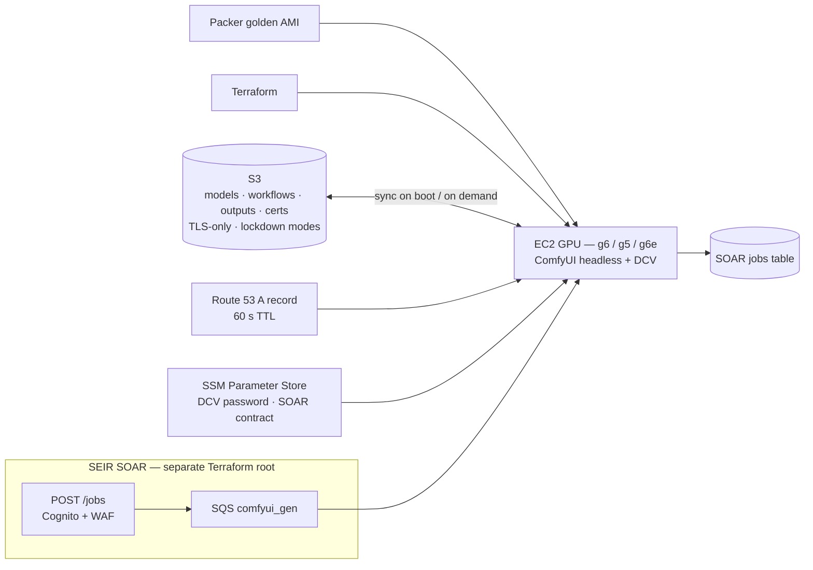

# ComfyUI GPU Inference Worker

[← Portfolio](../../README.md) · [Security / AI Platform](../../domains/security-ai-platform.md)

**Supporting** · Child of [SEIR — Serverless SOAR](../serverless/README.md) · AWS · Terraform + Packer · 2026
**Repository:** [jastek69/stability-matrix-headless-aws-infra](https://github.com/jastek69/stability-matrix-headless-aws-infra) 🔒

> A headless ComfyUI image- and video-generation server on an AWS GPU instance, built so the **instance is disposable**. Everything worth keeping (models, outputs, workflows, TLS certificates) lives in S3. The same instance doubles as a queue worker for the SOAR jobs platform.

---

## Problem

- **GPU boxes accumulate hand-made state.** A model downloaded over SSH or a node installed through a UI disappears the moment the instance is replaced.
- **Idle GPUs are expensive**, so the instance has to stop and start, resize, and rebuild without losing anything.
- **Model and output buckets are easy to over-share**, and just as easy to lock yourself out of.

## Solution

- **Golden AMI with Packer.** The software stack is baked, and `terraform apply` picks up a new AMI ID and replaces the instance.
- **S3 as the source of truth.** `user_data` re-pulls models and workflows and restores or reissues the Let's Encrypt certificate on every fresh boot, so a replacement comes back in the same state.
- **Vertical scaling in place.** Changing `instance_type` stops, modifies, and starts the instance. A 60-second Route 53 TTL covers any IP change, so no Elastic IP is needed.
- **Graduated bucket lockdown.** `bucket_access_mode` switches between `open`, `instance_and_root`, and `instance_only` using a `NotPrincipal` + `Deny` allow-list.
- **SOAR worker (Phase 2).** The instance consumes jobs from SEIR's Cognito/WAF-gated `POST /jobs` → SQS pipeline. The two repos are separate Terraform roots that never share state. They're wired through SSM contracts only.

## Architecture

## Impact

- **Rebuilds without loss.** A new AMI bake replaces the instance and restores full working state from S3.
- **Cost-aware sizing guide** (L4 / A10G / L40S / T4 trade-offs, spot savings of about 60–70%) plus explicit idle-stop guidance.
- **CI** runs through SOAR's reusable validate workflow, with an upstream-drift check against the parent platform.

## Engineering highlights

- **A real lockout, turned into a structural fix.** Applying a restrictive bucket policy as a non-root IAM user locked that user out of `PutBucketPolicy` itself, and recovery needed a root console login. `s3.tf` now always exempts whichever identity runs Terraform, which makes this class of lockout impossible.
- **Presigned URLs still work under lockdown** because S3 evaluates the *signer's* identity (the instance role) when the URL is used, not the requester's.
- **GPU quotas default to zero** on new accounts, so quota checks come before the first apply.

## Technologies

Terraform · Packer · EC2 GPU (NVIDIA L4 / A10G / L40S) · S3 bucket policies · IAM instance profiles · Route 53 · SSM Parameter Store · Let's Encrypt · Amazon DCV · ComfyUI · Stability Matrix · SQS · GitHub Actions

## Repository links

- Code, model-upload cheatsheet, and worker operations: [stability-matrix-headless-aws-infra](https://github.com/jastek69/stability-matrix-headless-aws-infra) 🔒
- Parent platform: [SEIR — Serverless SOAR](../serverless/README.md)
