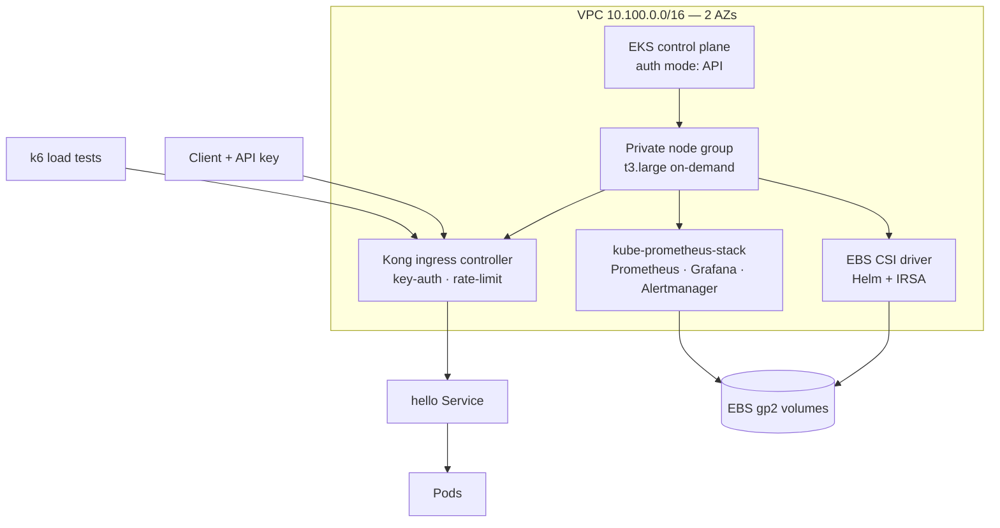

# EKS with EBS CSI, Kong, and Prometheus

[← Portfolio](../../README.md) · [Kubernetes](../../domains/kubernetes.md)

**Supporting** · AWS EKS · Terraform + Helm · 2026
**Repository:** [jastek69/anton-basic-eks-updated-helm](https://github.com/jastek69/anton-basic-eks-updated-helm)

> A Terraform-built EKS cluster and the platform layer workloads need on top of it: persistent storage through the EBS CSI driver with IRSA, Kong ingress with API-key auth and rate limiting verified under k6 load, and kube-prometheus-stack monitoring.

---

## Problem

- **A bare EKS cluster can't run stateful workloads.** Persistent volumes need the EBS CSI driver and a correctly scoped IAM role.
- **Exposing every service directly** scatters auth, rate limits, and routing across applications.
- **"Is it working?" needs evidence**, not just a 200 from one curl.

## Solution

- **Terraform from VPC to runtime.** VPC, public and private subnets across two AZs, NAT, EKS with `API` authentication mode, and a private on-demand node group.
- **IRSA for storage.** An OIDC provider plus a dedicated role for `ebs-csi-controller-sa`. The Helm provider installs the driver with an isolated repository cache, so ambient Helm config can't break the apply.
- **Kong as the single front door.** Ingress routes (`/hello` and more), a key-auth consumer, and a rate-limit plugin, with the Gateway API CRDs and cross-namespace Secret RBAC that KIC 3.x silently needs.
- **Policy under load.** k6 (5 VUs) and curl loops drive keyed and unkeyed traffic through Kong. Captured headers show the 5-per-minute limit counting down to 429.

## Architecture

## Impact

- **About 30 Terraform resources** stand up a working cluster. The `update-kubeconfig` step points `kubectl` at it automatically.
- **Test evidence captured** in `Reports/`: Kong install, hello route, and combined key + rate-limit k6 runs.
- Serves as the platform layer for [Kube Agentic](../kube-agentic/README.md), whose Phase 5 edge is Kong.

## Engineering highlights

- **KIC 3.x needs the Gateway API CRDs even for classic Ingress.** Without them, consumer credentials never reconcile, and nothing reports an error.
- **Controller RBAC is namespace-scoped by default.** Credentials in `default` were invisible to the `kong` namespace controller until an explicit Role and RoleBinding were added.
- **Teardown order matters.** Helm-created LoadBalancers and EBS volumes must be removed before `terraform destroy`, or they orphan and keep billing.

## Technologies

Terraform · Amazon EKS · IAM OIDC / IRSA · Helm · EBS CSI driver · Kong Ingress Controller · Gateway API · k6 · Prometheus · Grafana · Alertmanager

## Repository links

- Code, Kong lab, and cluster runbook: [anton-basic-eks-updated-helm](https://github.com/jastek69/anton-basic-eks-updated-helm)
- Workload layer: [Kube Agentic](../kube-agentic/README.md)
