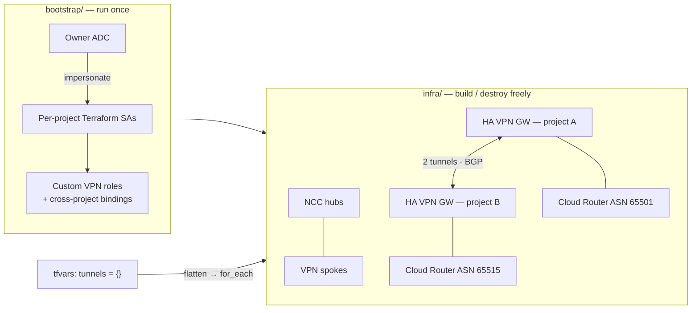

# GCP HA VPN Hub-and-Spoke

[← Portfolio](../../README.md) · [Cloud Networking](../../domains/cloud-networking.md)

**Supporting** · Team project · GCP · Terraform · 2025
**Repository:** [jastek69/gcp-ha-vpn-hub-spokes-SA-scaffolding](https://github.com/jastek69/gcp-ha-vpn-hub-spokes-SA-scaffolding)

> A six-project Google Cloud network spanning four continents. HA VPN tunnels with BGP connect every spoke, Network Connectivity Center hubs tie them together, and a Terraform scaffold separates identity bootstrap from infrastructure so no JSON service-account key is ever needed.

---

## Problem

- **Multi-project GCP networks tempt people into key files.** Downloaded service-account JSON keys are the most common way GCP credentials leak.
- **IAM and network have different lifecycles.** Rebuilding the network shouldn't mean tearing down identities, and adding a project shouldn't mean editing every tunnel by hand.
- **Mesh configuration explodes.** Each new spoke adds gateways, tunnels, router interfaces, and BGP peers.

## Solution

- **Bootstrap / infra split.** `bootstrap/` seeds service accounts, custom VPN roles, and cross-project bindings once. `infra/` builds and destroys compute and networking freely.
- **Service-account impersonation.** Terraform runs as your ADC identity impersonating per-project service accounts, and CI/CD works the same way through Workload Identity Federation. There are no key files.
- **Data-driven mesh.** A single `tunnels = {}` map in tfvars drives gateways, tunnels, router interfaces, and peers through `flatten()`ed locals. Adding a project means adding a map entry.

## Architecture

Dependency chain: **IAM → gateways → tunnels → router interfaces → BGP peers.**

## Impact

- **Six projects across four continents**, with seven reusable modules (vpc, subnet, hub, spoke, router_link, compute, network).
- **Operational scripts:** a Makefile, staged apply and destroy, CI bootstrap, lock cleanup, and a "doctor" diagnostic.
- **Team deliverable** from a seven-engineer group.

## Engineering highlights

- **`split("/", cidr)[0]`** gives the BGP peer its bare IP while the router interface keeps the `/30`, so one variable feeds both resources.
- **Site-to-site data transfer is regional.** It isn't supported in South America, which constrained where spokes could live.
- **One router per region per ASN relationship.** More routers only when you need administrative isolation.

## Technologies

Terraform · GCP HA VPN · Cloud Router (BGP) · Network Connectivity Center · IAM custom roles · service-account impersonation · Workload Identity Federation · Bash · Make

## Repository links

- Code and full setup guide: [gcp-ha-vpn-hub-spokes-SA-scaffolding](https://github.com/jastek69/gcp-ha-vpn-hub-spokes-SA-scaffolding)
- Workspace repository: [gcp-ha-vpn-hub-spokes](https://github.com/jastek69/gcp-ha-vpn-hub-spokes)
