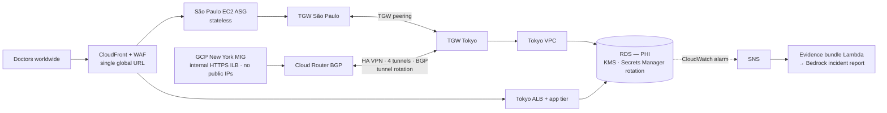

# Japan Medical — APPI Cross-Cloud Architecture

[← Portfolio](../../README.md) · [Cloud Networking](../../domains/cloud-networking.md)

**Featured** · AWS Tokyo + São Paulo · GCP · Terraform · 2026
**Repository:** [jastek69/Armageddon-C7-LAB4-SEIR](https://github.com/jastek69/Armageddon-C7-LAB4-SEIR) 🔒

> A multi-region, multi-cloud medical application where doctors anywhere can read and write patient records, but the records (PHI) are stored only in Japan, as Japan's privacy law (APPI) requires. *Global access doesn't require global storage.*

---

## Problem

- **Access is allowed; storage abroad isn't.** Japanese patient medical data must physically stay in Japan, even when the patient or doctor is overseas.
- **Doctors are on two clouds.** São Paulo staff run on AWS, and New York staff run on GCP.
- **Compliance needs visible paths.** Auditors have to be able to follow where every read and write travels.

## Solution

| Region | Role | Holds PHI? |
|---|---|---|
| 🇯🇵 **Tokyo** (AWS) | Data authority: RDS, TGW hub, Secrets Manager, logging, backups | **Yes, only here** |
| 🇧🇷 **São Paulo** (AWS) | Stateless compute: ASG + Transit Gateway spoke | No |
| 🇺🇸 **New York** (GCP) | Stateless compute: MIG behind an internal HTTPS load balancer, HA VPN + BGP to the AWS TGW | No |

- **Transit Gateway instead of VPC peering.** It gives centralized, auditable routing: a visible data corridor for compliance review.
- **Single global URL.** CloudFront terminates TLS, applies WAF, caches only content marked safe, and never stores PHI. Origins are cloaked behind CloudFront's managed prefix list.
- **If Tokyo is down, the system degrades, but residency is never violated.** That tradeoff is intentional: some latency in exchange for legal certainty.

## Architecture

## Impact

- **About 310 Terraform resources** across two AWS regions and a GCP project, including KMS, Secrets Manager rotation with Lambda, a private CA-issued certificate on the GCP ILB, and private DNS.
- **Auto incident response (human-in-the-loop).** CloudWatch alarm → SNS → a Lambda that gathers an evidence bundle → a Bedrock-drafted incident report with translation. A documented six-step runbook has a human verify alarm metadata, logs, and config sources before finalizing.
- **Operational tooling.** Staged apply and destroy scripts, sanity checks run on instances over SSM, VPN tunnel-rotation and WIF runbooks, and a Jenkins pipeline.

## Engineering highlights

- **The GCP side has two separate Cloud Routers**, one for NAT and one for BGP to AWS, so VPN routing and outbound egress never share a failure domain.
- **Keyless cross-cloud identity.** Workload Identity Federation instead of service-account keys.
- **Cleanup is part of the design.** Region-by-region "must verify clean" checklists and a verification script cover resources that block `terraform destroy`.

## Technologies

Terraform · AWS Transit Gateway + peering · GCP HA VPN · Cloud Router (BGP) · Internal HTTPS Load Balancer · CloudFront · WAFv2 · ACM + GCP Certificate Authority Service · RDS · KMS · Secrets Manager rotation · CloudWatch · SNS · Lambda · Amazon Bedrock · Amazon Translate · SSM · Jenkins

## Repository links

- Code, deployment guide, and runbooks: [Armageddon-C7-LAB4-SEIR](https://github.com/jastek69/Armageddon-C7-LAB4-SEIR) 🔒
- Related: [Zion — Multi-Region Transit Gateway](../transit-gateway/README.md)
