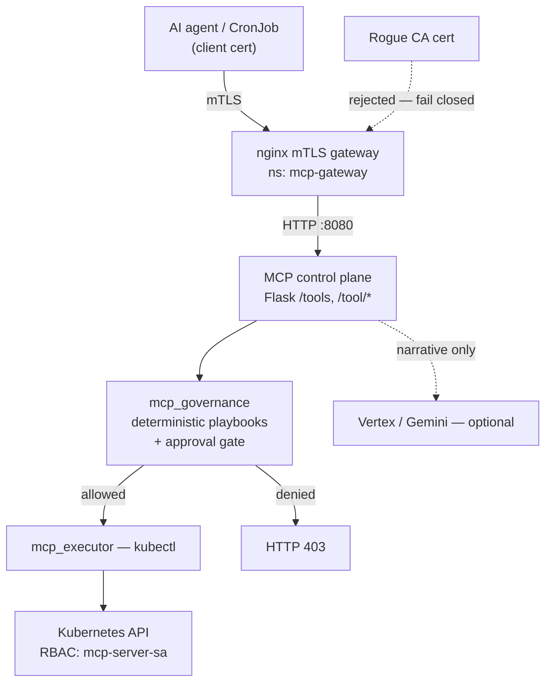

# Kube Agentic

[← Portfolio](../../README.md) · [Kubernetes](../../domains/kubernetes.md)

**Featured** · Kubernetes (kind / GKE / EKS) · 2026
**Repository:** [jastek69/kube-agentic](https://github.com/jastek69/kube-agentic) 🔒

> Zero-trust MCP for AI agents on Kubernetes. Agents never touch `kubectl` directly. They prove identity with an mTLS client certificate, discover tools through a thin MCP control plane, and can only run what a deterministic playbook allows.

---

## Problem

- **Tool access is all-or-nothing.** Once an agent can reach the API server, every verb in its ServiceAccount is in play, including restart and delete, with no per-finding gate.
- **Identity is assumed, not proven.** Pod network reachability gets treated as trust.
- **Models get to authorize.** Severity and "should we restart?" drift into prompt output. When the model is wrong or unavailable, the pipeline stalls or acts unsafely.
- **Cloud lock-in in the manifests.** Duplicate AWS and GCP YAML trees drift apart.

## Solution

- **mTLS gateway.** nginx requires a client certificate signed by a lab client CA before any request reaches MCP.
- **Thin MCP control plane.** It advertises tools and builds typed requests. Governance and execution are separate modules, and `kubectl` lives only in the executor.
- **Deterministic playbooks.** Risk score → severity → playbook, all in code.
- **Explicit containment approval.** `restart_deployment` returns HTTP 403 unless the caller sends `approved=true` and an approver ID.
- **One YAML tree.** Only the registry URI and ServiceAccount annotations are cloud-specific. kind loads images locally for zero-cost testing.

**Governing rule: the LLM narrates, code authorizes.**

## Architecture

| Layer | Responsible for | Not responsible for |
|---|---|---|
| mTLS gateway | Cryptographic client identity | Business authorization |
| MCP control plane | Tool advertisement, routing | Holding kubectl logic |
| Playbooks / governance | Whether a tool may run | Narrative |
| RBAC | What the executor can do | Who called MCP |
| LLM (optional) | Human-readable narrative | Severity, playbook, permission |

## Impact

- About **50 shared manifests** deploy unchanged to kind, GKE, and EKS.
- **44 pytest tests** pin the governance invariants with kubectl stubbed, run in CI: no playbook at any severity auto-allows restart, approval needs both the flag and a named approver, and an unapproved restart returns 403 without ever reaching the executor.
- A **zero-trust proof**: an agent holding a rogue-CA certificate must fail closed before it correlates any telemetry.
- The pattern is carried over from [SEIR SOAR](../serverless/README.md): MCP invokes executors instead of embedding business logic.

## Engineering highlights

- **Request-time DNS in nginx.** Resolving the backend at startup CrashLoops the gateway on a fresh cluster, so a variable `proxy_pass` lets the gateway start first.
- **Two identities, two failure domains.** GKE Workload Identity for Vertex and the MCP RBAC ServiceAccount are deliberately kept separate.
- **"Authenticate, then work" is enforced in the agent.** It exits on a failed `GET /tools`, so a mis-mounted certificate can't produce healthy-looking findings.

## Roadmap

Kong at the edge (key-auth, rate limit), a Deterministic Governance Core on the hot path, Ollama for on-prem inference behind Kong, and Kubeflow for multi-step agent workflows.

## Technologies

Kubernetes · kind · GKE · EKS · nginx mTLS · OpenSSL CA · Flask MCP · Python · Docker · RBAC · Vertex AI / Gemini (optional)

## Repository links

- Code, install guide, and phased plan: [kube-agentic](https://github.com/jastek69/kube-agentic) 🔒
- Cluster platform layer: [EKS with EBS CSI, Kong, and Prometheus](../eks-ebs/README.md)
