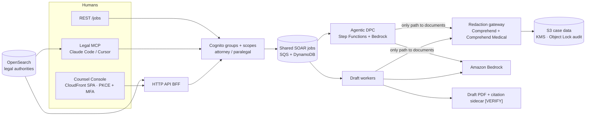

# SEIR Legal AI

[← Portfolio](../../README.md) · [Security / AI Platform](../../domains/security-ai-platform.md)

**Featured** · Child of [SEIR — Serverless SOAR](../serverless/README.md) · AWS `us-west-2` · 2026
**Repository:** [jastek69/SEIR-Serverless-SOAR-for-legal-agents](https://github.com/jastek69/SEIR-Serverless-SOAR-for-legal-agents) 🔒

> A case-tracking and drafting fleet for an education-law practice, built as a **clone-and-layer** on the SOAR platform. Attorneys get drafted status reports, case digests, and Due Process Complaints. The models only ever see redacted records, and IAM enforces that, not a prompt.

---

## Problem

- **Recurring deadlines are easy to miss.** Purchase-of-service renewals, IEP cadence, and status reports repeat across the whole caseload.
- **Drafting touches sensitive data.** A Due Process Complaint is assembled from IEPs, assessments, and notes that contain student identity, medical detail, and education records (PHI and FERPA).
- **Model-confident citations are a liability.** Special-education administrative decisions are poorly covered by mainstream legal search, and every citation has to be verifiable.
- **One "god role" doesn't fit a law firm.** Attorneys and paralegals need different entitlements on every surface: web, chat, and API.

## Solution

| Element | Design |
|---|---|
| **Redact before the model** | Agent roles are *denied* `s3:GetObject` on case documents. The only read path is a redaction gateway: Comprehend + Comprehend Medical produce a regenerated PDF. Scanned PDFs fail closed. |
| **Placeholders by construction** | Drafts use `[STUDENT]` / `[PARENT]` / `[DOB]` because workers *can't* read identity. An attorney re-identifies the final draft. |
| **Frozen jobs contract** | Drafting rides SOAR's shared jobs queues. Only attorneys may submit `dpc_draft`. New capability means a new job type, never a changed shape. |
| **Agentic DPC** | Optional Bedrock tool loop on Step Functions that picks which *redacted* documents to read. |
| **Monitors and dispatcher** | Deadline, payment, and case-hygiene monitors produce findings. A dispatcher plans work through applicability → policy → prerequisite → dedupe → budget. |
| **Graduated autonomy** | `observe` → `draft` → `notify`, set live in SSM. No tier ever files, serves, or emails anyone. |
| **Verifiable citations** | Drafts ship citation sidecars marked `[VERIFY]`. OpenSearch lexical (BM25) search covers administrative decisions, and semantic search fails closed until it beats lexical on a counsel-graded test set. |

## Architecture

## Impact

- **Built for a real practice, not a lab sketch.** It serves attorney and paralegal workflows across two case types with different funding and retention rules.
- **About 460 Terraform resources** in one apply. It shares the SOAR Cognito pool, WAF, REST API, and jobs module.
- **238 pytest tests** (all passing) plus a separate retrieval golden-eval set. CI runs through SOAR's reusable validate workflow, plus an upstream-drift job that flags when the parent platform moves.
- The **same control plane can serve other practice areas**: swap prompts, corpora, and obligation catalogs without forking the orchestration.

## Engineering highlights

- **Privacy is an IAM property.** Redaction isn't a best-effort pre-processing step. Model-facing roles have no path to unredacted objects at all.
- **Psychometric scores mis-tagged as ages** by entity recognition are suppressed, so drafts don't invent figures.
- **`DISPATCHED ≠ COMPLETED`.** Deferred work is an open obligation, not a skip.
- **Retrieval is honest about quality.** Lexical search passed its gold set, and embedding-based search stays disabled until it beats lexical on counsel-graded queries.

## Technologies

Terraform · Cognito · API Gateway · Lambda · Step Functions · Amazon Bedrock · Comprehend / Comprehend Medical · OpenSearch · DynamoDB · S3 Object Lock · KMS · CloudFront · SES · EventBridge · MCP (stdio + hosted HTTP) · Clio API bridge

## Repository links

- Code, operator runbook, and design deep-dives: [SEIR-Serverless-SOAR-for-legal-agents](https://github.com/jastek69/SEIR-Serverless-SOAR-for-legal-agents) 🔒
- Parent platform: [SEIR — Serverless SOAR](../serverless/README.md)
