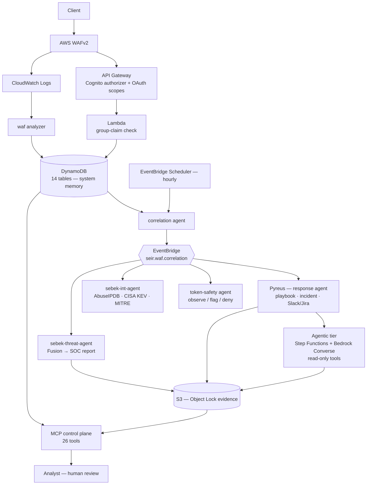
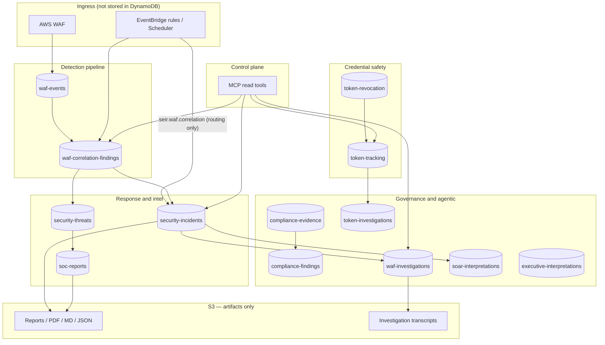
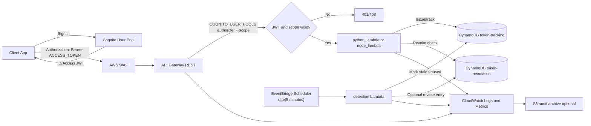
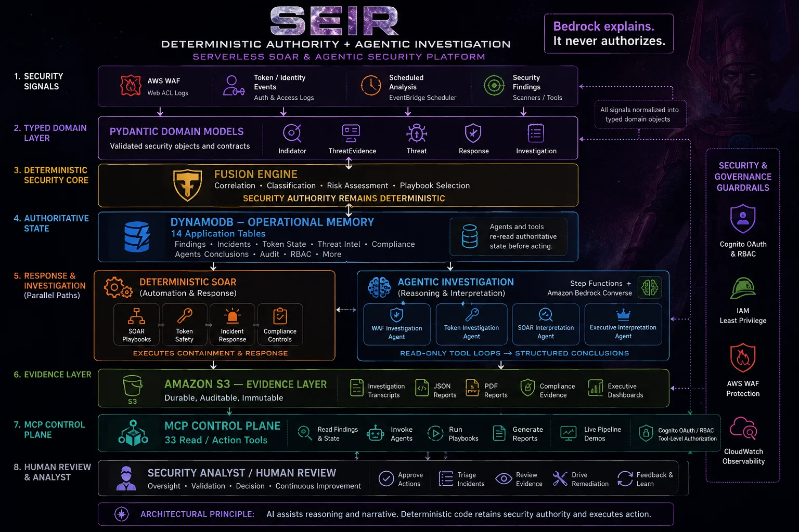

# SEIR — Serverless SOAR

[← Portfolio](../../README.md) · [Security / AI Platform](../../domains/security-ai-platform.md)

**Featured** · Parent platform · AWS `us-west-2` · Terraform · 2026
**Repository:** [jastek69/SEIR-Serverless-SOAR](https://github.com/jastek69/SEIR-Serverless-SOAR) 🔒

> A Terraform-managed serverless reference implementation of role-based access control and automated security response. An authenticated API request can flow all the way through to an AI-authored incident report without a human in the loop, and without the AI ever making a security decision.

---

## Problem

- **Authorization is usually one layer deep.** An API Gateway authorizer proves *who* the caller is, not *what they may do*. If that one check is misconfigured, nothing behind it objects.
- **Credentials outlive their use.** Tokens get issued, never used, and never revoked, which is exactly the artifact a credential-theft workflow leaves behind.
- **Security telemetry is written, not read.** WAF logs pile up in S3. The signal only shows once events are correlated by source, target, and time, and nobody does that by hand at 2 a.m.
- **Findings arrive without context.** A flagged IP or CVE says nothing about what the indicator actually *is* until someone looks it up mid-incident.

## Solution

Five subsystems, each independently deployable and verifiable:

| Subsystem | What it does |
|---|---|
| **Layered authorization** | API Gateway scope gate → in-Lambda group claim check → IAM (service-to-service only). Each layer fails independently. |
| **Token lifecycle tracking** | DynamoDB stores token hashes, never plaintext. A scheduled detector finds tokens issued but never used, then alerts, revokes, and reports. |
| **Autonomous correlation & response** | WAF events are scored hourly into findings. EventBridge fans each finding out to four agents in parallel: playbook/incident, token safety, intel enrichment, and threat assessment. |
| **Threat-intel investigation** | AbuseIPDB, CISA KEV, and MITRE ATT&CK enrichment. Confidence escalates when independent sources agree. |
| **Reporting** | Executive and compliance reports (NIST CSF 2.0, CIS v8, PCI DSS 4.0, ISO 27001) authored by Bedrock as PDF and JSON, in English, Japanese, and Portuguese from one call. |

**Governing rule: Bedrock explains, it never authorizes.** Severity, risk score, and playbook selection are deterministic code. If Bedrock is unavailable, the pipeline still completes using a templated summary.

## Architecture

### DynamoDB system memory

Fourteen tables hold authoritative state. Events route work; agents and MCP tools re-read the table instead of trusting the payload. S3 holds artifacts only.

### Token lifecycle and layered authorization

Scope check at API Gateway, group check in Lambda, and a scheduled detector that finds issued-but-unused tokens.

### Deterministic authority + agentic investigation

Eight layers from signal to human review. Pydantic types every signal, Fusion decides, DynamoDB remembers, S3 proves, and Bedrock explains.

### Diagram gallery

| Diagram | What it shows |
|---|---|
| [End-to-end auth and token/SOAR flow](../../images/serverless/auth-token-soar-flow.jpg) | JWT validation at the API Gateway authorizer; the scheduled unused-token path with a Bedrock narrative |
| [Agent / WAF-correlation flow](../../images/serverless/waf-correlation-flow.jpg) | Each finding fans out to four parallel agents; threat assessment adds the SOC-report hop |
| [Trigger topology](../../images/serverless/trigger-topology.webp) | What starts every agent: scheduler, finding event, StartExecution, downstream event, or job failure |
| [RBAC model and component reference](../../images/serverless/rbac-model.jpg) | The two authorization layers and the question each one answers |
| [MCP + Sephiroth](../../images/serverless/mcp-sephiroth.jpg) | Hosted MCP under Cognito RBAC for claude.ai, and the EC2 test rig |
| [Heralds dashboard](../../images/serverless/heralds-dashboard.jpg) · [detection & action](../../images/serverless/heralds-detection-action.jpg) · [agentic tier](../../images/serverless/heralds-agentic.jpg) · [reporting](../../images/serverless/heralds-reporting.jpg) | The operator view of every agent: calls, errors, latency, and triggers |

## Impact

- **About 420 Terraform resources** across the root stack and modules (jobs, translation), with Cognito, WAF, 14 DynamoDB tables, Step Functions, and a private-VPC RDS intake.
- **436 pytest + moto unit tests** that need no live AWS, run in GitHub Actions along with `terraform fmt`/`validate`. The same workflows are published as **reusable workflows** that validate three descendant repositories.
- **Proven degradation path.** On 2026-07-28 a Bedrock billing failure silently degraded every narrative to its template, and the pipeline kept reporting. That incident led to making fallbacks observable.
- **Parent platform** for the Legal Case Management AI Platform, the ComfyUI GPU worker, and the Vertex RAG registry.

## Engineering highlights

- **Event payloads are addresses, not evidence.** Every agent re-reads the authoritative DynamoDB record from `detail.finding_id`, and conditional puts (`INC-<finding_id>`, uuid5 IDs) make redelivery a no-op.
- **Risk accumulates across windows.** A source that scans steadily under the rate limit escalates across hourly findings instead of minting a new, unrelated MEDIUM each time.
- **Refresh-token rotation** on the human client means a replayed refresh token is rejected outright. The page is honest that this rejection is currently invisible to the SOC.
- **Configuration that's actually state.** The token-safety tier (`observe`/`flag`/`deny`) is operator-set in SSM mid-incident, with `ignore_changes` so an apply can't silently revert it. It has its own operator runbook.
- **Named lessons.** Examples: the Cognito authorizer is a mode switch, not a toggle (ID vs access token). API Gateway's 401/403 diverge from RFC 9110. The authorizer's 300 s cache is why a separate revocation denylist exists.

## Technologies

Terraform · Cognito (MFA, OAuth scopes, PKCE) · API Gateway REST + HTTP · Lambda (Python, Node) · WAFv2 · DynamoDB · S3 Object Lock · RDS MySQL · EventBridge · Step Functions · SNS · Amazon Bedrock · Secrets Manager · SSM · CloudWatch · FastMCP · Slack / Jira · GitHub Actions

## Repository links

- Code, deployment, runbook, and 30+ technical docs: [SEIR-Serverless-SOAR](https://github.com/jastek69/SEIR-Serverless-SOAR) 🔒
- Children: [SEIR Legal AI](../legal-platform/README.md) · [ComfyUI GPU worker](../comfyui-stability/README.md) · [Vertex AI RAG](../vertex-rag/README.md)
- Related: [Kube Agentic](../kube-agentic/README.md), the same MCP and playbook pattern on Kubernetes
