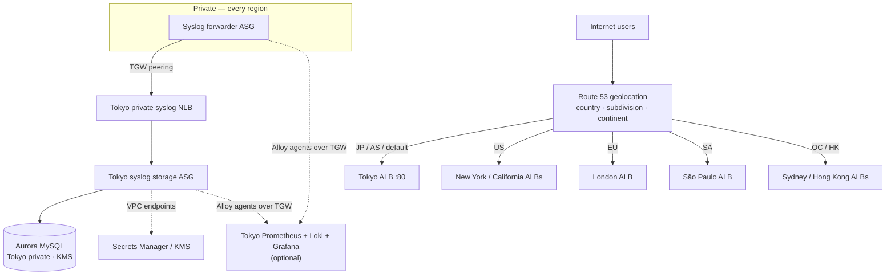

# Zion — Multi-Region Transit Gateway

[← Portfolio](../../README.md) · [Cloud Networking](../../domains/cloud-networking.md)

**Featured** · AWS, 7 regions · Terraform modules · 2026
**Repository:** [jastek69/tfe-zion-armageddon-bhoejm](https://github.com/jastek69/tfe-zion-armageddon-bhoejm)

> Local application hosting in seven cities (Tokyo, New York, London, São Paulo, Sydney, Hong Kong, and California), connected by a Transit Gateway mesh into Japan, with geolocation DNS and a hard rule that syslog and personal data never leave Japan.

---

## Problem

- **Seven copy-pasted region stacks.** One change meant seven edits, and drift was constant.
- **One DNS record sent everyone to Tokyo.** Customers needed to be served locally.
- **Data residency.** Syslog and personal data couldn't be stored abroad. Transfer had to reach Japan without VPN, and no public port beyond 80 was allowed.

## Solution

- **One module pair per city.** `regional-network` + `regional-site`, driven by a single `locals.sites` map. The Transit Gateway and hub services stay at the root.
- **Geolocation DNS.** Route 53 maps country, US subdivision, and continent to the nearest regional ALB. The default is Tokyo.
- **Forward, don't store.** Foreign syslog tiers are forwarders. Tokyo is the only storage tier and the only writer to Aurora, over private networking, with Secrets Manager reached through VPC endpoints.

**Governing rule: apps may run anywhere; syslog durability and personal data stay inside Japan, over private TGW paths.**

## Architecture

## Impact

- **About 100 Terraform resources** across seven regions, expressed as five reusable modules instead of seven file sets.
- **Verification is scripted.** `verify.sh` / `verify.py` confirm ALB reachability, that HTTPS is blocked, RDS writes, Secrets Manager access, and SSM access.
- **Observability without breaking residency.** A self-hosted PLG stack ships metrics and logs over the existing TGW mesh, so the time-series data never leaves Japan. An optional Grafana Cloud front end connects through an outbound-only PDC tunnel.

## Engineering highlights

- **Circular module dependencies** were broken by lifting the shared security group to the root.
- **`count` can't depend on apply-time values**, so database wiring is gated on a boolean, not on the Aurora endpoint.
- **Private instances can't reach non-S3 package hosts**, so the observability server mirrors the Alloy binary on its own NLB listener.
- **Byte-identical user-data when a feature is disabled.** `join("\n", compact([...]))` keeps launch templates from churning.

## Technologies

Terraform modules · Transit Gateway + inter-region peering · VPC · ALB / NLB · Auto Scaling · Route 53 geolocation + query logging · WAFv2 · Aurora MySQL · Secrets Manager · KMS · VPC endpoints · SSM Session Manager · Prometheus · Loki · Grafana · Grafana Alloy

## Repository links

- Code, runbook, and verification suites: [tfe-zion-armageddon-bhoejm](https://github.com/jastek69/tfe-zion-armageddon-bhoejm)
- Related: [Japan Medical — APPI Cross-Cloud](../healthcare-cross-platform/README.md) answers the same residency question for PHI
