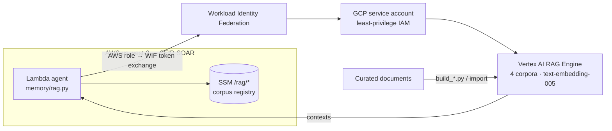

# Vertex AI RAG Corpora

[← Portfolio](../../README.md) · [Security / AI Platform](../../domains/security-ai-platform.md)

**Supporting** · GCP Vertex AI + AWS · Terraform + Python · 2026
**Repository:** not yet published

> A retrieval layer of four Vertex AI RAG Engine corpora, about 1,340 documents on agentic AI, Kubernetes and Argo, LLM inference, and AWS, queried from AWS Lambda agents in the SOAR platform through Workload Identity Federation. No GCP key ever lands in AWS.

---

## Problem

- **Agents need domain knowledge they weren't trained on**, and it should come from a curated corpus, not the open web.
- **Cross-cloud credentials are a liability.** Calling GCP from AWS Lambda usually means a service-account JSON key stored somewhere in AWS.
- **Retrieval quality isn't automatic.** Raising `top_k` from 5 to 10 still returned 8 of 10 chunks from a single document.

## Solution

- **Four purpose-built corpora**, with `text-embedding-005` embeddings on the serverless RAG Engine: `sebek-agentic-ai` (605 files), `sebek-kubernetes-argo` (232), `sebek-llm-inference` (294), and `sebek-aws-idp` (209).
- **Keyless cross-cloud identity.** A Terraform-managed service account plus Workload Identity Federation lets AWS Lambda roles call Vertex AI.
- **Registry in SOAR.** Corpus resource IDs live in SSM (`/rag/*`, `us-west-2`) and are managed by the SOAR Terraform. A break-glass script covers the same keys.
- **Post-retrieval diversity.** `/rag/max-chunks-per-document` caps results per source document, which fixes the single-document dominance that `top_k` alone couldn't.

## Architecture

## Impact

- **About 1,340 documents** indexed across four corpora, with create, import, list, rebuild, and cleanup scripts.
- **Credential-free integration** between the AWS agent platform and GCP retrieval.
- Uses the current `agentplatform` client (`google-cloud-aiplatform >= 2.1`) instead of the deprecated `vertexai.rag` module.

## Engineering highlights

- **Pick one resource-name form and stick to it.** Project-number and project-ID paths address the same corpus but compare as different strings, which produces false mismatches.
- **Some limits belong to the caller.** Vertex doesn't enforce per-document caps, so the query layer does.

## Technologies

Vertex AI RAG Engine · text-embedding-005 · Workload Identity Federation · Terraform (google provider) · Python · AWS Lambda · SSM Parameter Store · GitHub Actions (corpus sync)

## Repository links

- Source: local project `gcp/vertex_ai`. Not yet pushed to GitHub.
- Consumer: [SEIR — Serverless SOAR](../serverless/README.md)
