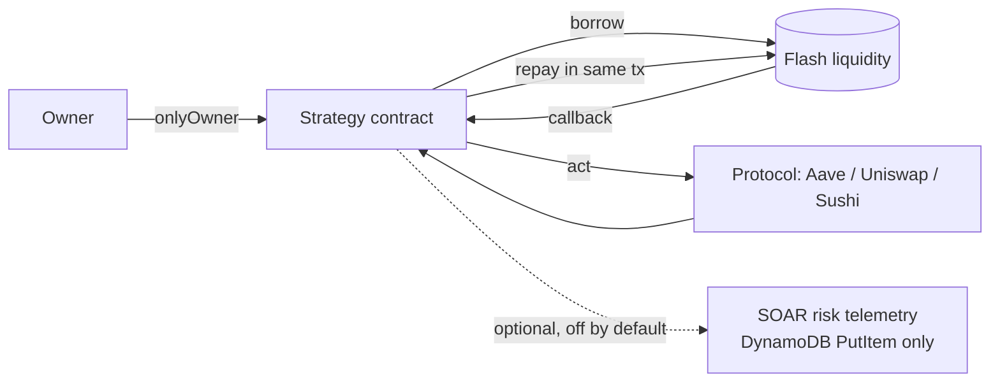

# Blockchain

[← Portfolio](../README.md)

DeFi smart-contract engineering on Ethereum mainnet forks: flash liquidity, lending-protocol integration, and DEX arbitrage. Every strategy is simulated before it executes, and operational risk is treated as something to measure, not guess.

---

## Overview

The current blockchain work is two production-shaped DeFi projects, both rebuilt in 2026 from earlier bootcamp versions:

- a **leveraged yield farm** migrated from Compound V2 to Aave V3
- a **cross-DEX arbitrage bot** rebuilt for Uniswap v4's singleton `PoolManager`

Both are Hardhat projects tested against pinned mainnet forks. Both also emit optional risk telemetry into the same SOAR-style pipeline used across the cloud security work in this portfolio.

---

## Smart-contract architecture

Both projects use the same core pattern: **borrow, act, and repay inside one atomic transaction**, so a failed strategy costs only gas.

| Concern | Yield Farm | Arbitrage Bot |
|---|---|---|
| Funding leg | Balancer V2 flash loan (zero fee) | Uniswap v4 flash accounting (`take` / `settle`, no lender) |
| Protocol | Aave V3 `Pool`, aTokens, variable debt tokens | Uniswap v4 `PoolManager` + Sushiswap V2 |
| Entry point | `deposit()` / `withdraw()` → `receiveFlashLoan` | `executeTrade()` → `unlockCallback` |
| Safety invariant | Exit reads *live* debt, never a recomputed value | Whole trade reverts unless it clears `minProfit` |
| Tooling | Solidity 0.8.18, Hardhat 2.29, ethers v6 | Solidity 0.8.26 (Cancun), Hardhat 2.29, ethers v6 |

---

## Security practices

- **Callers are gated twice.** Strategy entry points are `onlyOwner`, and flash-loan callbacks reject any caller except the vault or PoolManager.
- **Atomicity is the safety net.** There's no partial state to unwind. A strategy either completes profitably or reverts.
- **Unsupported tokens are refused outright.** The pair scanner flags fee-on-transfer and rebasing tokens as `UNSAFE` instead of ranking them.
- **Telemetry holds no keys.** The SOAR integration can write one DynamoDB item and read one SSM flag. It can't sign a transaction.
- **Failure directions are chosen deliberately.** Telemetry fails open, so monitoring never blocks trading. The halt flag fails safe, so an SSM outage never un-halts a halted bot. A halt blocks *opening* a position, never *exiting* one.
- **Alert thresholds come from measurements.** The health-factor alert sits at 1.05 because the healthy operating point measured on a fork is 1.114.

---

## Featured projects

### [Uniswap v4 Arbitrage Bot](../architectures/blockchain/trading-bot-v4.md)

Self-funding Uniswap v4 ↔ Sushiswap arbitrage using v4 flash accounting: no capital, no loan fee, and the trade reverts unless it's profitable. A pair scanner simulates real round trips to separate genuine opportunities from liquidity mirages.

`Solidity` `Uniswap v4` `Hardhat` `ethers v6` `Multicall3`
→ **Repository:** [jastek69/trading_bot-master](https://github.com/jastek69/trading_bot-master)

### [Leveraged Yield Farm — Aave V3](../architectures/blockchain/yield-farm-aave-v3.md)

A flash-loan-bootstrapped USDC lending loop on Aave V3, migrated from Compound V2 after DAI's collateral LTV was set to zero. Opening and closing a position each take one transaction, and the operating health factor was measured on a mainnet fork.

`Solidity` `Aave V3` `Balancer V2` `Hardhat` `ethers v6`
→ **Repository:** [jastek69/YieldFarm](https://github.com/jastek69/YieldFarm) 🔒

---

## Supporting work (2022–2023 archive)

Earlier full-stack dApp work from Dapp University. Kept for context. These projects are superseded by the two above.

| Project | Summary | Links |
|---|---|---|
| DeFi Ecosystem | FlashLoan pool and trader contracts, two AMM front ends | [Code](https://github.com/jastek69/DefiEcoSystem) · [Demo pt 1](https://youtu.be/nJDNXK3zOsA) · [Demo pt 2](https://youtu.be/_SwimVjuV8U) |
| Sobek Market / Dark Unicorn Market | React AMM exchange front ends for the DeFi Ecosystem | [Sobek](https://github.com/jastek69/defiecosystem_frontend_amm1) · [Dark Unicorn](https://github.com/jastek69/defiecosystem_frontend2_amm2) |
| Decentralized Exchange | Order-book DEX, React + Truffle | [Code](https://github.com/jastek69/blockchain-developer-bootcamp) |
| DAO | Proposal/vote governance dApp, React | [Code](https://github.com/jastek69/DAO) |

---

## Supporting articles and diagrams

- Liquidity-mirage analysis: why a 14-of-14-day spread lost 98% on a real round trip ([Trading Bot page](../architectures/blockchain/trading-bot-v4.md#engineering-highlights))
- Health-factor calibration: the arithmetic behind the 1.114 operating point ([Yield Farm page](../architectures/blockchain/yield-farm-aave-v3.md#engineering-highlights))
- Risk telemetry consumer: [SEIR1-SOAR-blockchain-infrastructure](https://github.com/jastek69/SEIR1-SOAR-blockchain-infrastructure) 🔒
