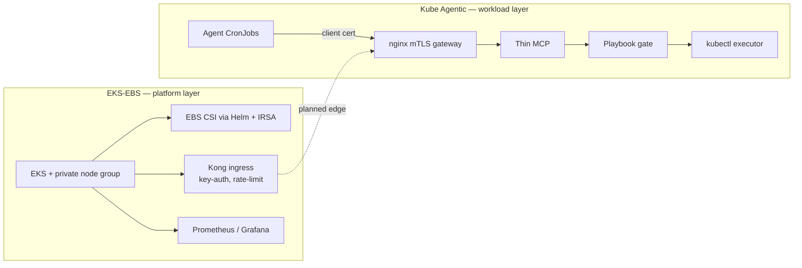

# Kubernetes

[← Portfolio](../README.md)

Kubernetes platform work, from a Terraform-built EKS cluster with storage, ingress, and monitoring up to a zero-trust control plane for AI agents that must call cluster tools safely.

---

## Overview

The two projects form a stack. **EKS-EBS** stands up the cluster and its platform layer: EBS CSI via Helm and IRSA, Kong ingress with key-auth and rate limiting, and Prometheus/Grafana. **Kube Agentic** is the workload that runs on top: agents that prove identity with mTLS and can only run the tools a deterministic playbook allows.

---

## Featured projects

### [Kube Agentic](../architectures/kube-agentic/README.md)

Zero-trust MCP for AI agents on Kubernetes. Agents present a CA-signed client certificate, a thin MCP control plane advertises tools, and deterministic playbooks decide whether a tool may run. Destructive tools need explicit human approval. One YAML tree targets kind, GKE, and EKS.

`Kubernetes` `nginx mTLS` `MCP` `Python` `RBAC` `kind / GKE / EKS`
→ **Repository:** [jastek69/kube-agentic](https://github.com/jastek69/kube-agentic) 🔒

---

## Supporting projects

### [EKS with EBS CSI, Kong, and Prometheus](../architectures/eks-ebs/README.md)

A Terraform EKS cluster with private nodes, OIDC/IRSA, and the EBS CSI driver via Helm. Kong ingress is load-tested with k6 for key-auth and rate limiting, and kube-prometheus-stack handles monitoring.

`Terraform` `EKS` `Helm` `IRSA` `Kong` `k6` `Prometheus`
→ **Repository:** [jastek69/anton-basic-eks-updated-helm](https://github.com/jastek69/anton-basic-eks-updated-helm)
